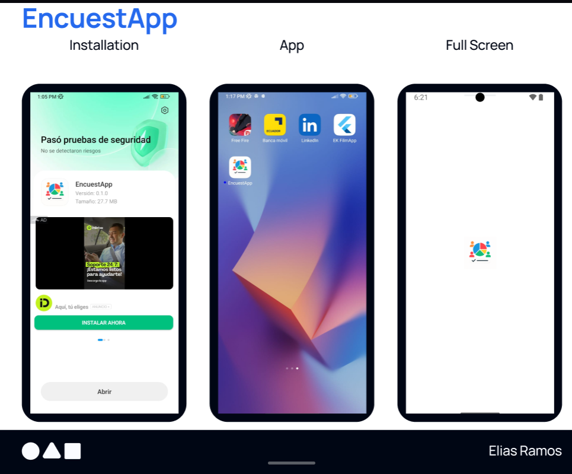
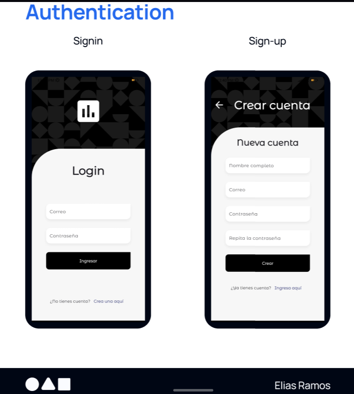
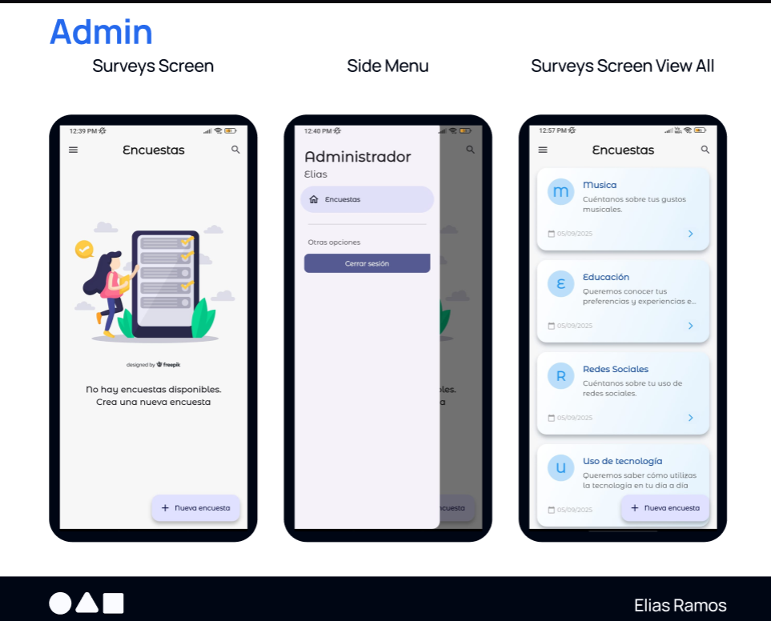
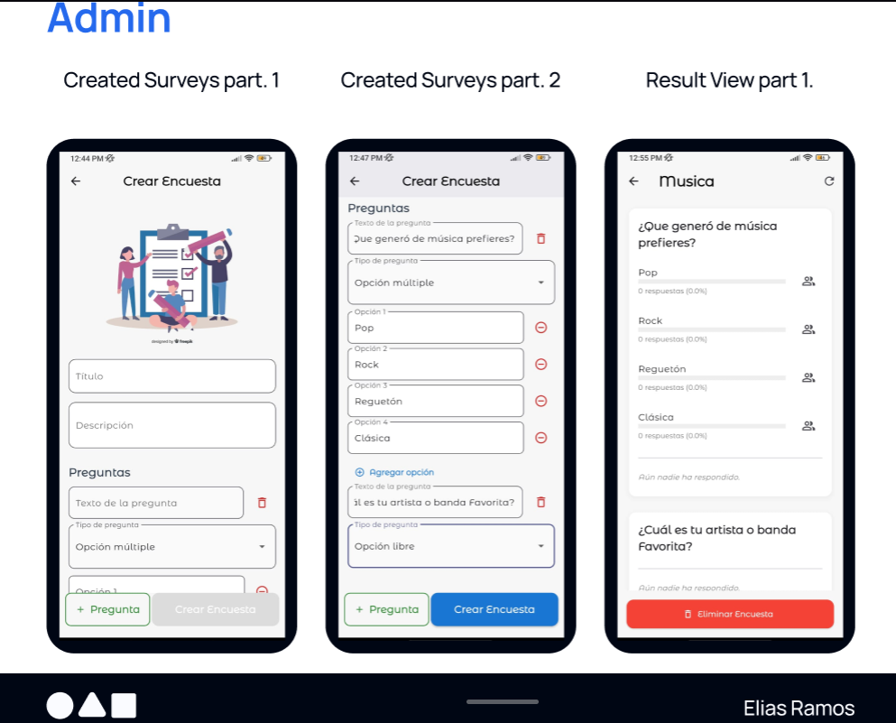
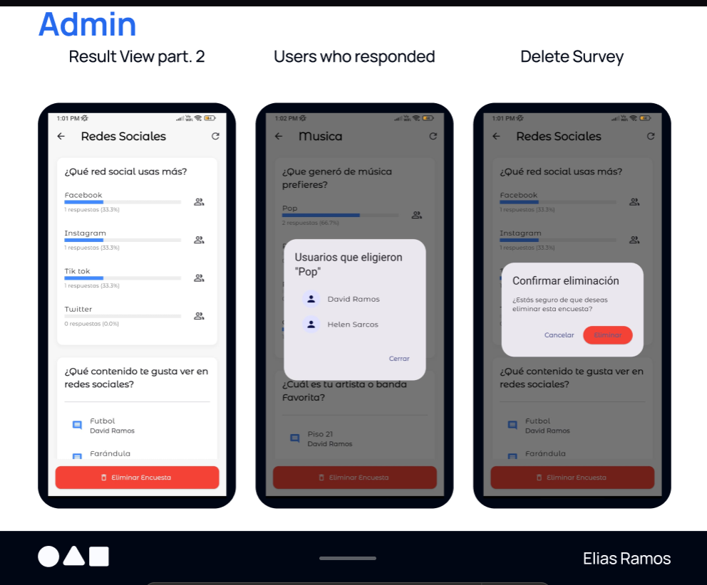
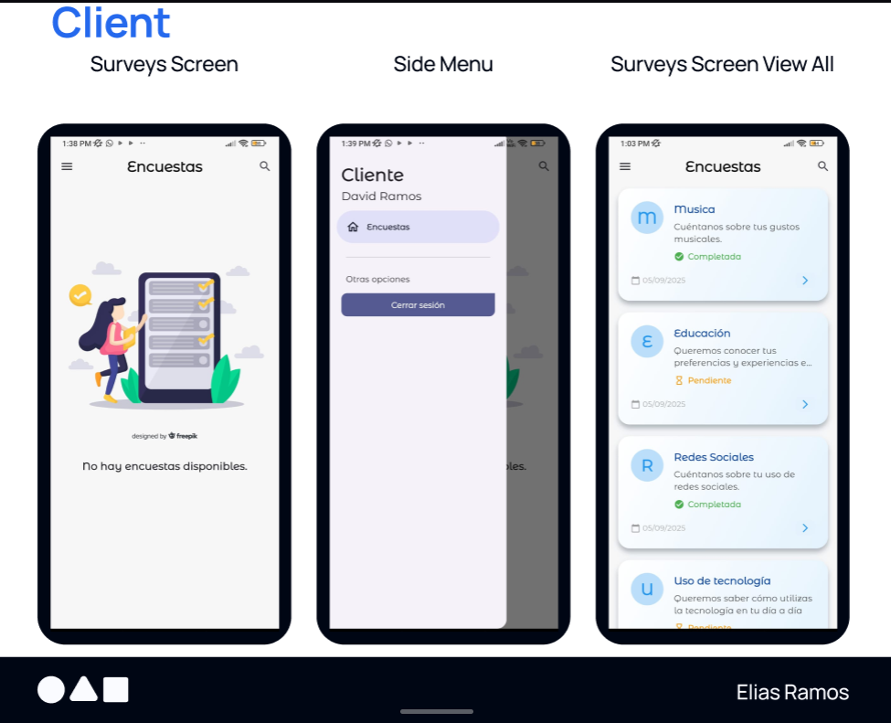
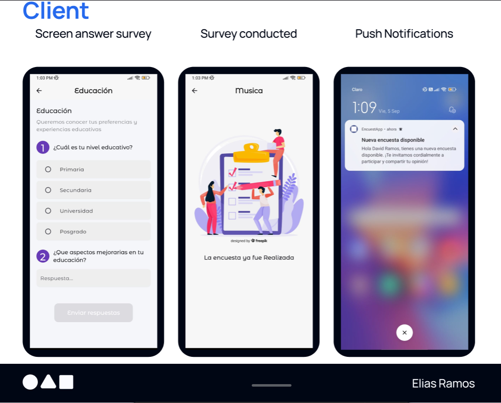

# ETM-Orexe-Elias-Ramos - Proyecto Encuestas

## 1. Descripción del Proyecto

Esta aplicación permite la gestión y participación en encuestas de manera sencilla y multiplataforma. Incluye un backend desarrollado en Django (API REST) y un frontend en Flutter.  
**Roles principales:**  
● **Cliente:** Puede ver y responder encuestas.  
● **Administrador:** Puede ver todas las encuestas y respuestas, además de crear nuevas encuestas.  
El sistema está pensado para ser escalable y fácil de mantener.

## 2. Instrucciones de Ejecución

### Backend

1. Navega a la carpeta del backend:
   ```bash
   cd backend_prueba_tecnica
   ```
2. Instala las dependencias:
   ```bash
   pip install -r requirements.txt
   ```
3. Realiza las migraciones de la base de datos:
   ```bash
   python manage.py migrate
   ```
4. Ejecuta el servidor apuntando a la IP:
   ```bash
   python manage.py runserver 0.0.0.0:8000
   ```

### Frontend

1. Navega a la carpeta del frontend:
   ```bash
   cd frontend_encuestas
   ```
2. Instala las dependencias:
   ```bash
   flutter pub get
   ```
3. Ejecuta la app en el emulador o dispositivo:
   ```bash
   flutter run
   ```

#### Configuración

- Asegúrate de tener configurados los archivos `.env` tanto en backend como en frontend para las variables de entorno necesarias (por ejemplo, claves secretas, endpoints, configuración de Firebase, etc.).

## 3. Decisiones Técnicas

- **Tecnologías:**  
  - Backend: Python, Django, Django REST Framework por su robustez y facilidad para crear APIs seguras y escalables.
  - Frontend: Flutter, por su capacidad multiplataforma y rápido desarrollo de interfaces modernas.
- **Base de datos:**  
  - PostgreSQL como base de datos principal, por su robustez y escalabilidad tanto en desarrollo como en producción.
- **Gestión de roles:**  
  - Uso de permisos y autenticación JWT en Django para separar usuarios administradores y usuarios normales.
- **Arquitectura:**  
  - Backend y frontend desacoplados, comunicación vía API REST.
  - Uso de Riverpod y Bloc en Flutter para la gestión de estado y notificaciones.
- **Notificaciones push:**  
  - Integración con Firebase Cloud Messaging para envío y recepción de notificaciones en tiempo real.

## 4. Capturas de Pantalla

> **Encuesta App:**
>
> 
>
> **Autentificacion:**
>
> 
>
> **Pantallas del administrador:**
>
> 
>
> **Pantallas del administrador:**
>
> 
>
> **Pantallas del administrador:**
>
> 
>
> **Pantallas del administrador:**
>
> 
>
> **Pantallas del Cliente:**
>
> 
>
> **Pantallas del administrador + Push Notifications:**
>
> 


## 5. Detalles sobre Notificaciones Push

- **Configuración:**  
  - El frontend utiliza Firebase Cloud Messaging (FCM). La configuración de Firebase se encuentra en `frontend_encuestas/lib/firebase_options.dart` y los archivos de configuración (`google-services.json` para Android, `GoogleService-Info.plist` para iOS).
  - El backend utiliza la función `send_push_notification_v1` para enviar notificaciones a los dispositivos registrados.

- **Funcionamiento:**  
  - Al iniciar sesión, la app solicita permisos y registra el token de dispositivo en el backend.
  - Cuando se crea una nueva encuesta o hay un evento relevante, el backend envía una notificación push a los usuarios mediante FCM.
  - Al pulsar la notificación push, la app navega directamente a la lista de encuestas para que el usuario pueda responder de inmediato.

---

> Última actualización: 02 Septiembre 2025
